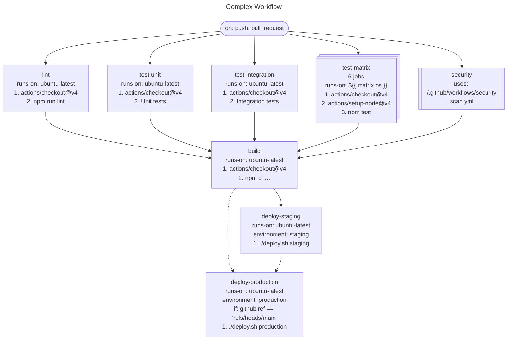

```mermaid
---
title: "Complex Workflow"
---
flowchart TB
    on(["on: push, pull_request"])
    lint["lint<br>runs-on: ubuntu-latest<br>1. actions/checkout@v4<br>2. npm run lint"]
    test_unit["test-unit<br>runs-on: ubuntu-latest<br>1. actions/checkout@v4<br>2. Unit tests"]
    test_integration["test-integration<br>runs-on: ubuntu-latest<br>1. actions/checkout@v4<br>2. Integration tests"]
    test_matrix@{ shape: procs, label: "test-matrix<br>6 jobs<br>runs-on: ${{ matrix.os }}<br>1. actions/checkout@v4<br>2. actions/setup-node@v4<br>3. npm test" }
    security[["security<br>uses: ./.github/workflows/security-scan.yml"]]
    build["build<br>runs-on: ubuntu-latest<br>1. actions/checkout@v4<br>2. npm ci …"]
    deploy_staging["deploy-staging<br>runs-on: ubuntu-latest<br>environment: staging<br>1. ./deploy.sh staging"]
    deploy_production["deploy-production<br>runs-on: ubuntu-latest<br>environment: production<br>if: github.ref == 'refs/heads/main'<br>1. ./deploy.sh production"]
    on --> lint
    on --> test_unit
    on --> test_integration
    on --> test_matrix
    on --> security
    lint --> build
    test_unit --> build
    test_integration --> build
    test_matrix --> build
    security --> build
    build --> deploy_staging
    build -.-> deploy_production
    deploy_staging -.-> deploy_production
```
