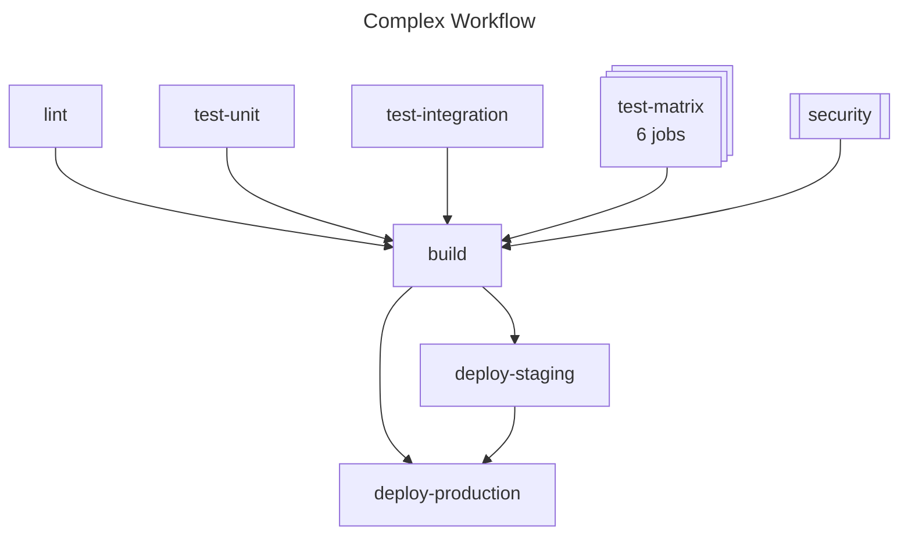

```mermaid
---
title: "Complex Workflow"
---
flowchart TB
    lint["lint"]
    test_unit["test-unit"]
    test_integration["test-integration"]
    test_matrix@{ shape: procs, label: "test-matrix<br>6 jobs" }
    security[["security"]]
    build["build"]
    deploy_staging["deploy-staging"]
    deploy_production["deploy-production"]
    lint --> build
    test_unit --> build
    test_integration --> build
    test_matrix --> build
    security --> build
    build --> deploy_staging
    build --> deploy_production
    deploy_staging --> deploy_production
```
