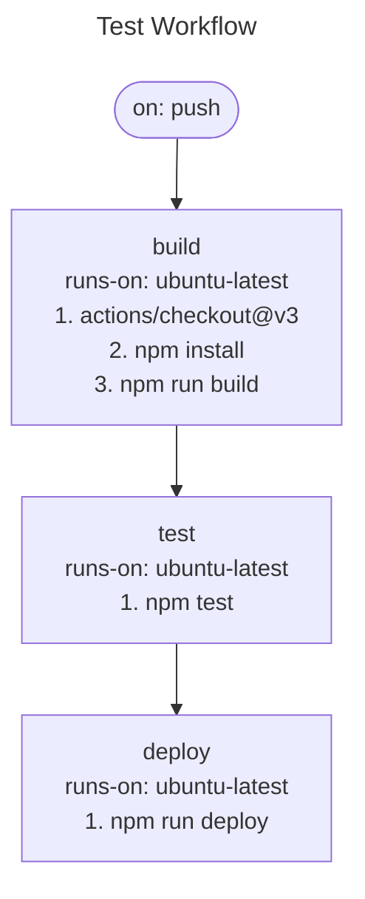

```mermaid
---
title: "Test Workflow"
---
flowchart TB
    on(["on: push"])
    build["build<br>runs-on: ubuntu-latest<br>1. actions/checkout@v3<br>2. npm install<br>3. npm run build"]
    test["test<br>runs-on: ubuntu-latest<br>1. npm test"]
    deploy["deploy<br>runs-on: ubuntu-latest<br>1. npm run deploy"]
    on --> build
    build --> test
    test --> deploy
```
